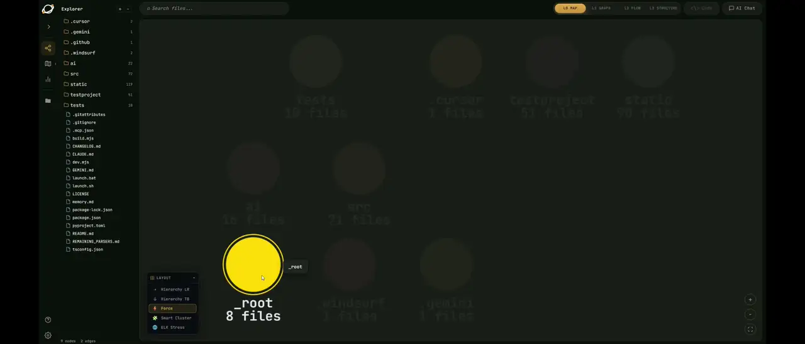
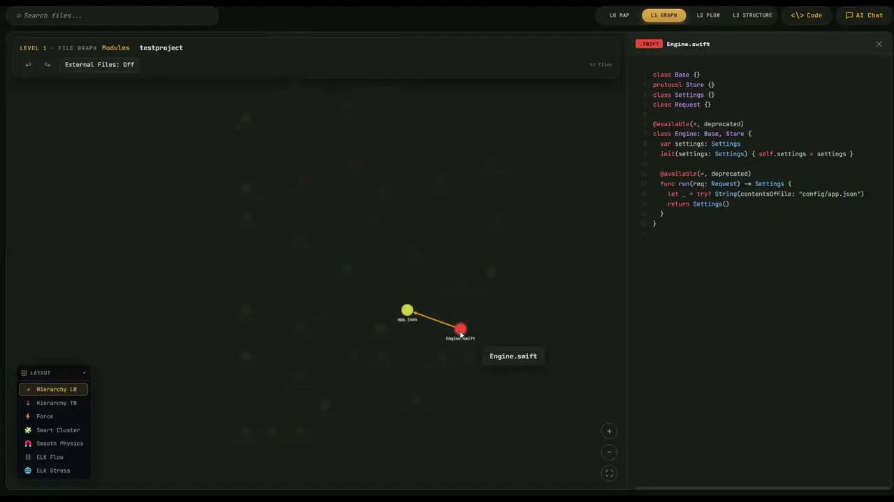

# VizCode

> **A zero-dependency code visualization tool that helps you see, navigate, and explain any repository.**

VizCode scans a local project and turns the codebase into an interactive browser map. It runs with the Python standard library, keeps everything local, and can lightly plug into AI workflows through MCP, static reports, and terminal chat. No cloud upload, no API key, no package install required for normal use.

Use it when you want to move from "what is in this repo?" to "how do these files and functions interact?" without reading files one by one.

---

## Demo

### Function Drill Down

Drill into a file to inspect functions, calls, symbols, and the relationships inside a file or across connected files.



Full MP4: [VizcodeDemo2.mp4](https://github.com/RealPapaya/VizCode/releases/latest/download/VizcodeDemo2.mp4)

### Overview Mode

Start from the full repository view to understand project size, modules, dependencies, code health, churn, hotspots, tech debt, and architecture issues.



Full MP4: [VizcodeDemo.mp4](https://github.com/RealPapaya/VizCode/releases/latest/download/VizcodeDemo.mp4)

### Interface Preview

VizCode opens with a dashboard, then lets you move from repository overview into modules, files, functions, and symbols.


---

## Use VizCode

| Method | Command | Best For |
|--------|---------|----------|
| **One-click launcher** | `launch.bat` / `./launch.sh` | Easiest local start on Windows, macOS, or Linux |
| **Direct scan** | `python src/vizcode.py <path>` | Quick visualization without installing anything |
| **Global command** | `vizcode <path>` | Running VizCode from any folder after `pip install -e .` |
| **Headless report** | `python src/vizcode.py <path> --scan-only` | CI, docs, and AI context generation |
| **Terminal chat** | `python src/vizcode.py <path> --chat` | Asking AI about a scanned codebase in the terminal |
| **One-shot AI question** | `python src/vizcode.py <path> --ai "..."` | Getting a direct answer from the local code context |
| **AI assistant MCP** | `python ai/install.py --cursor` / `--windsurf` / `--gemini` / `--all` | Letting AI tools query code structure without dumping raw files |
| **Claude Code skill** | `/vizcode` | Scan, report, browser launch, and optional semantic enrichment |

**Requires Python 3.6+**. End-users do not need Node, npm, Docker, or third-party Python packages.

```bash
git clone https://github.com/RealPapaya/VizCode.git
cd VizCode

launch.bat              # Windows
./launch.sh             # macOS / Linux
```

A browser window opens at `http://localhost:7777`.

Optional global command:

```bash
pip install -e .
vizcode <path>
```

---

## Features

- **Zero dependencies** - pure Python standard library backend; nothing to install for normal use.
- **Local-first analysis** - source code stays on your machine.
- **Repository overview** - dashboard, project size, code health, churn, hotspots, tech debt, and architecture issues.
- **Four zoom levels** - move from repo/module overview to files, functions, and symbols.
- **Function drill down** - inspect call flow inside a file and follow relationships across files.
- **Full-codebase graph** - Galaxy View renders modules, files, and functions in one WebGL canvas.
- **Symbol browser** - class/member/signature graph with bundled edges and expand/collapse navigation.
- **Live search** - streaming fuzzy search across symbols and file contents.
- **Multi-language support** - deep parsers for major languages plus broad fallback parsing for 50+ languages.
- **Dual language UI** - English / Traditional Chinese toggle built in.
- **Themes** - dark mode and multiple color themes.
- **Lightweight AI integration** - MCP tools, static reports, terminal chat, and platform skill files.

---

## From Overview To Detail

VizCode is organized as a layered map. Start broad, then drill down only when you need detail.

| Level | View | What You See |
|-------|------|--------------|
| **L0** | Module Map | Repository structure and cross-module dependencies |
| **L1** | File Dependency Graph | Files, imports, includes, and file-level relationships |
| **L2** | Function Call Flow | Function definitions, calls, docstrings, and per-file flow |
| **L3** | Symbol Browser | Classes, methods, members, signatures, references, and symbol edges |

The browser graph focuses on static structure such as imports, includes, calls, and symbols. The AI workflow can add semantic relationships that static parsing cannot reliably infer, such as runtime spawns, shared data files, protocol implementations, or framework conventions.

---

## AI Assistant Integration

VizCode ships with an MCP server and platform-specific skill files so AI tools can ask structured questions about a codebase instead of reading raw source files into the prompt.

Install configs for your AI tool:

```bash
python ai/install.py --cursor      # Cursor AI
python ai/install.py --windsurf    # Windsurf
python ai/install.py --gemini      # Gemini CLI
python ai/install.py --copilot     # GitHub Copilot (static report only)
python ai/install.py --all         # all of the above
python ai/install.py --list        # show install status
```

MCP tools:

| Tool | Purpose |
|------|---------|
| `vizcode_l0()` | Module overview and cross-module dependencies |
| `vizcode_l1(module)` | File list and import edges for a module |
| `vizcode_l2(file)` | Function call graph and docstrings for a file |
| `vizcode_l3(file)` | Detailed symbols, members, signatures, and symbol edges |
| `vizcode_query(q)` | Keyword search across modules and edges |
| `vizcode_path(a, b)` | Shortest dependency path from A to B |
| `vizcode_health()` | Dead code, god files, circular dependencies, and health signals |
| `vizcode_report()` | Full `INDEX.md` overview |

Claude Code additionally supports the `/vizcode` skill:

```text
/vizcode --parse   # Scan + generate report + open browser
/vizcode --ai      # Scan + semantic analysis
/vizcode           # Full flow: scan + AI + report + browser
```

Semantic analysis (`--ai`) is Claude-only. It enriches `.vizcode/semantic_cache.json`, which can then be read by any AI tool connected through the MCP server.

---

## When To Generate An AI Report

Choose **YES** when:

- You plan to ask AI about the codebase.
- You want architectural insights such as hotspots, communities, and health.
- You are documenting a project structure.
- You are analyzing a large codebase for the first time.

Choose **NO** when:

- You only need a quick visualization.
- You already generated the report recently.
- You are in a hurry; report generation usually adds about 10-30 seconds.

---

## How It Works

```text
launch.bat  (or /vizcode --parse)
  -> src/vizcode.py                  (CLI/TUI - pick a directory)
      -> src/server/server.py        (HTTP server on :7777)
          -> src/core/analyze_viz.py (scan -> build graph JSON)
              -> src/core/detector.py
              -> src/parsers/*.py
          -> browser UI from html_builder.py + build/*.js

python src/vizcode.py <path> --scan-only
  -> .vizcode/scan_cache.json
  -> .vizcode/INDEX.md + L1/ + L2/ + L3/
  -> src/server/mcp_server.py
      -> vizcode_l0 / l1 / l2 / l3 / query / path / health / ...

/vizcode --ai  (Claude Code only)
  -> Claude infers non-static relationships from scan_cache
      -> semantic_enricher.py writes .vizcode/semantic_cache.json
```

---

## Language Support

| Language | Parser | Depth |
|----------|--------|-------|
| Python | `python_parser.py` | imports, functions, classes, methods |
| JavaScript / TypeScript | `js_parser.py` | imports, functions, classes, interfaces, enums |
| Go | `go_parser.py` | imports, functions, structs, interfaces |
| C / C++ | `c_cpp_parser.py` | includes, functions, methods, structs, typedefs, enums |
| C# / .NET | `csharp_parser.py` | using directives, classes, records, interfaces, methods |
| BIOS / EDK2 | `uefi_parser.py` + `common_parser.py` | ASM refs, INF/DEC/DSC/FDF, SDL/CIF, VFR/HFR/UNI/ASL |
| Java, Rust, Swift, Kotlin, Ruby, PHP, Lua, Haskell, and 50+ more | `common_parser.py` | imports, functions, classes, language-aware patterns |

---

## Project Structure

```text
VizCode/
|-- src/
|   |-- vizcode.py            # CLI/TUI entry point (--scan-only / --chat / --ai)
|   |-- core/                 # graph pipeline, html builder, detector, analytics, git history
|   |-- parsers/              # language parsers and universal fallback parser
|   `-- server/               # HTTP API, job manager, fetcher, MCP server
|-- ai/
|   |-- vizbridge.py          # Web AI provider routing and tool-use loop
|   |-- chat_cli.py
|   |-- install.py
|   `-- providers/            # anthropic, openai, gemini, grok, ollama, custom
|-- static/                   # TypeScript source; edit here
|-- build/                    # committed browser JavaScript generated from static/
|-- .vizcode/                 # scan cache, semantic cache, INDEX.md, L1/L2/L3 reports
|-- .mcp.json                 # MCP server declaration for Claude Code
|-- launch.bat
|-- launch.sh
`-- pyproject.toml
```

The backend is zero-install. The frontend is TypeScript, but the compiled `build/` output is committed, so end-users still need only Python. Node is required only when modifying the frontend.

---

## API Endpoints

| Endpoint | Description |
|----------|-------------|
| `POST /analyze` | Start an analysis job with an SSE stream |
| `GET /result?job=JID` | Full analysis JSON |
| `GET /file?path=...` | Read a source file |
| `GET /search-stream?job=JID&q=...` | Streaming full-text search |
| `GET /symbol-graph?job=JID&sym=SID` | Symbol-centric subgraph |
| `GET /symbol-refs?job=JID&sym=SID` | All references to a symbol |
| `GET /symbols?job=JID&query=...&kind=...` | Fuzzy symbol search |

---

## Development

End-users need nothing but Python. Node is only required if you want to change the frontend under `static/**/*.ts`, which compiles to `build/**/*.js` with [esbuild](https://esbuild.github.io/).

```bash
npm install          # one-time frontend dev setup
npm run build        # compile static/*.ts -> build/*.js
npm run check        # type-check only
npm run dev          # watch + rebuild + launch the app
```

Live dev loop:

```bash
npm run dev                 # analyze "." with VizCode itself
npm run dev -- <path>       # analyze another project
```

Edit `static/**/*.ts`, then refresh the browser with `Ctrl+F5`. Do not hand-edit `build/**/*.js`; it is generated and should be committed alongside frontend source changes after `npm run build`.

---

## Extending VizCode

### Add A Language Parser

1. Create `src/parsers/mylang_parser.py` with a `scan_mylang(src, ext)` function returning:

   ```python
   return (imports, funcdefs, funccalls, extra, calls_by_func, symbol_defs)
   ```

2. Dispatch it in `src/core/analyze_viz.py` inside `scan_file()`, and register the extension in `SCAN_EXT`.
3. Add the file type to `src/core/detector.py` and the legend in `static/core/viz_constants.ts`.

### Add A Theme

Edit the theme CSS under `static/styles/`. Each theme is a single CSS class applied to `<body>`. Run `npm run build` afterward so the change lands in `build/`.

---

## License

MIT - see [LICENSE](LICENSE).

---

<p align="center">
  Built for developers who want to <em>see</em> their code, not just read it.
</p>
