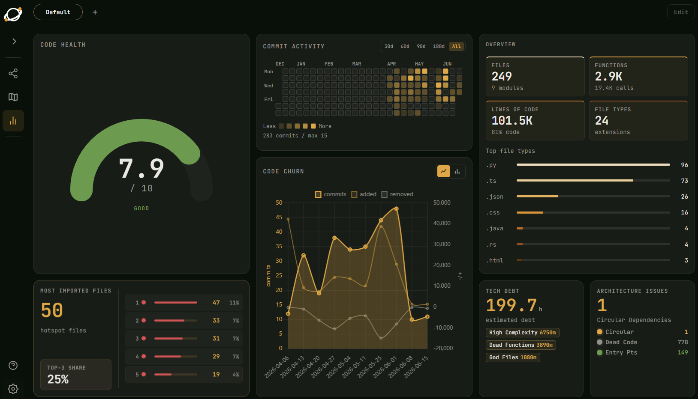

# VizCode

> **Understand any codebase at a glance — without installing anything.**

VizCode is a local-first code visualization tool that scans your project and renders an interactive dependency graph directly in your browser. No cloud uploads, no API keys, no `pip install`. Just run it and explore.



**Explore large codebases visually:** dependency graphs, symbol navigation, code health, architecture issues, AI-ready reports, and local browser analysis.

[Demo](#demo) · [Quick start](#quick-start) · [AI integration](#ai-assistant-integration)

---

## Demo

Watch VizCode scan a project, open the browser UI, and move from high-level code health into graph and symbol-level exploration.

### Demo Videos

https://github.com/RealPapaya/VizCode/releases/latest/download/VizcodeDemo.mp4

https://github.com/RealPapaya/VizCode/releases/latest/download/VizcodeDemo2.mp4

### Codebase Overview

VizCode starts with a dashboard that summarizes project size, code health, commit activity, churn, hotspots, tech debt, and architecture issues before you dive into individual files.


---

## Why VizCode?

Most code tools make you read files one by one. VizCode turns the project into a navigable map so you can see structure, hotspots, dependencies, symbols, and AI context before opening source.

- **See architecture first** — jump from project overview to modules, files, functions, and symbols.
- **Find risky areas fast** — code health, churn, dead code, circular dependencies, tech debt, and hotspots.
- **Navigate with context** — search, graph traversal, back/forward history, and symbol-focused views.
- **Feed AI better context** — MCP tools expose structured codebase knowledge instead of raw file dumps.

---

## Features

- **Zero dependencies** — pure Python standard library on the backend. Nothing to install.
- **Multi-language** — deep parsers for Python, JavaScript/TypeScript, Go, C/C++/BIOS/EDK2. 50+ additional languages via a universal fallback parser (Java, Rust, Swift, Kotlin, Ruby, PHP, and more).
- **Four zoom levels**
  - **L0 — Module Map** : high-level overview of your project's module structure
  - **L1 — File Dependency Graph** : file-level import/include relationships
  - **L2 — Function Call Flow** : call-graph inside a single file
  - **L3 — Symbol Browser** : detailed class/member/signature and symbol-edge view
- **Symbol View** — class-level graph with compound `PUBLIC / PRIVATE` member cards, bundled edges, expand/collapse, and Back/Forward navigation
- **Galaxy View** — full-codebase WebGL graph (Sigma.js) showing every module, file, and function in one canvas
- **Live search** — streaming fuzzy search across all symbols and file contents
- **Dual language UI** — English / 繁體中文 toggle built-in
- **Dark mode + themes** — multiple color themes out of the box
- **AI assistant integration** — MCP server + per-platform skill files let any major AI tool (Claude Code, Cursor, Windsurf, Gemini CLI) navigate your codebase without reading raw source files

---

## 🚀 Quick Start

**Requires Python 3.6+** (Windows / macOS / Linux). No third-party packages.

```bash
git clone https://github.com/RealPapaya/VizCode.git
cd VizCode

launch.bat              # Windows
./launch.sh             # macOS / Linux
```

A browser window opens at `http://localhost:7777`. Done.

**Optional — install a global `vizcode` command:**

```bash
pip install -e .        # then run `vizcode <path>` from anywhere
```

---

## 🤖 AI Assistant Integration

VizCode ships with an MCP server and platform-specific skill files so AI tools can explore your codebase at a fraction of the token cost.

**Install configs for your AI tool:**

```bash
python ai/install.py --cursor      # Cursor AI
python ai/install.py --windsurf    # Windsurf
python ai/install.py --gemini      # Gemini CLI
python ai/install.py --copilot     # GitHub Copilot (static report only)
python ai/install.py --all         # all of the above
python ai/install.py --list        # show install status
```

**MCP tools (Cursor / Windsurf / Gemini CLI / Claude Code):**

| Tool | Purpose |
|------|---------|
| `vizcode_l0()` | Module overview + cross-module dependencies |
| `vizcode_l1(module)` | File list + import edges for a module |
| `vizcode_l2(file)` | Function call graph + docstrings for a file |
| `vizcode_l3(file)` | Detailed symbols, members, signatures, and symbol edges |
| `vizcode_query(q)` | Keyword search across modules and edges |
| `vizcode_path(a, b)` | Shortest dependency path from A to B |
| `vizcode_health()` | Dead code, god files, circular deps |
| `vizcode_report()` | Full INDEX.md overview |

**Claude Code additionally supports `/vizcode` skill:**

```
/vizcode --parse   # Scan + generate report + open browser
/vizcode --ai      # Scan + semantic analysis (LLM-inferred edges)
/vizcode           # Full flow (scan + AI + report + browser)
```

Semantic analysis (`--ai`) is Claude-only — it infers non-static relationships (runtime spawns, shared data files, protocol implementations) that AST cannot detect.

**Terminal AI (any provider):**

```bash
python src/vizcode.py <path> --chat       # interactive AI chat in the terminal
python src/vizcode.py <path> --ai "..."   # one-shot question, prints the answer
```

---

## 📊 Usage Modes

| Mode | Command | Interactive | AI Report | Browser | Use Case |
|------|---------|-------------|-----------|---------|----------|
| **Launcher (menu)** | `launch.bat` / `./launch.sh` | ✅ | Optional | ✅ | **Easiest** — double-click and go |
| **Global command** | `vizcode <path>` *(after `pip install -e .`)* | ✅ Progress | Optional | ✅ | Run from any folder |
| **Direct scan** | `python src/vizcode.py <path>` | ✅ Progress | | ✅ | Quick viz, no menu |
| **Headless** | `python src/vizcode.py <path> --scan-only` | | ✅ | | CI/CD, AI integration |
| **Terminal chat** | `python src/vizcode.py <path> --chat` | ✅ | | | Ask AI about the code in the terminal |

### When to generate AI report?

**Choose YES if:**
- ✅ You plan to ask AI about the codebase
- ✅ You want architectural insights (hotspots, communities, health)
- ✅ You're documenting the project structure
- ✅ First time analyzing a large codebase

**Choose NO if:**
- ⚡ You only need quick visualization
- ⚡ You've already generated the report before
- ⚡ You're in a hurry (report generation adds ~10-30 seconds)

---

## 🗺️ How It Works

```
launch.bat  (or /vizcode --parse)
  └─▶ src/vizcode.py            (TUI — pick a directory)
        └─▶ src/server/server.py     (HTTP server on :7777)
              └─▶ src/core/analyze_viz.py   (scan → build graph JSON)
                    ├─▶ src/core/detector.py     (auto-detect project type)
                    └─▶ src/parsers/*.py         (per-language AST extraction)
                              ↓
                    browser ← html_builder.py + build/*.js (compiled TS)

python src/vizcode.py <path> --scan-only   (headless scan for AI tools)
  └─▶ .vizcode/scan_cache.json
  └─▶ .vizcode/INDEX.md + L1/ + L2/ + L3/ (hierarchical report tree)
  └─▶ src/server/mcp_server.py        (MCP stdio, used by all AI tools)
        └─▶ vizcode_l0 / l1 / l2 / l3 / query / path / health / …

/vizcode --ai  (Claude Code only — semantic enrichment)
  └─▶ Claude infers non-static relationships from scan_cache
        └─▶ semantic_enricher.py  (writes .vizcode/semantic_cache.json)
```

The browser graph shows static edges (imports, calls). The MCP server additionally exposes semantic edges inferred by Claude (`/vizcode --ai`), visible to any AI tool that connects afterward.

---

## 🌐 Language Support

| Language | Parser | Depth |
|----------|--------|-------|
| Python | `python_parser.py` | imports · functions · classes · methods |
| JavaScript / TypeScript | `js_parser.py` | imports · functions · classes · interfaces · enums |
| Go | `go_parser.py` | imports · functions · structs · interfaces |
| C / C++ | `c_cpp_parser.py` | includes · functions · methods · structs · typedefs · enums |
| C# / .NET | `csharp_parser.py` | using directives · classes · records · interfaces · methods |
| BIOS / EDK2 | `uefi_parser.py` + `common_parser.py` | ASM refs · INF/DEC/DSC/FDF · SDL/CIF · VFR/HFR/UNI/ASL |
| Java, Rust, Swift, Kotlin, Ruby, PHP, Lua, Haskell, … (50+) | `common_parser.py` | imports · functions · classes (language-aware patterns) |

---

## 📁 Project Structure

```
VizCode/
├── src/
│   ├── vizcode.py            # CLI / TUI entry point  (--scan-only / --chat / --ai)
│   ├── core/                 # analyze_viz (graph pipeline) · html_builder · detector ·
│   │                         #   semantic_enricher · analytics_helpers · git_history · …
│   ├── parsers/              # one parser per language: python, js, go, c_cpp, csharp +
│   │                         #   ~35 long-tail · firmware (uefi/acpi/asm) · common_parser
│   └── server/               # server (HTTP+API) · job_manager · fetcher · mcp_server
├── ai/
│   ├── vizbridge.py          # Web AI: provider routing + tool-use loop
│   ├── chat_cli.py · install.py
│   └── providers/            # anthropic · openai · gemini · grok · ollama · custom
├── static/                   # TypeScript SOURCE — edit here (*.ts)
│   ├── viz.ts                # SPA bootstrap (D3 + Cytoscape main view)
│   ├── core/ ui/ styles/     # i18n/state/constants · layout/sidebar/toolbar · css
│   ├── features/             # graph/ · galaxy_view/ · Dashboard_view/ · symbol_view/ · …
│   └── types/                # data.d.ts (backend JSON contract) · globals.d.ts
├── build/                    # COMMITTED esbuild output — the *.js the browser loads.
│                             #   Generated from static/*.ts; never hand-edit.
├── package.json · build.mjs · dev.mjs · tsconfig.json   # frontend toolchain (npm)
├── .vizcode/
│   ├── scan_cache.json        # Per-file AST cache
│   ├── semantic_cache.json    # AI-inferred edges (written by /vizcode --ai)
│   ├── INDEX.md               # L0 report (~100-200 lines, always start here)
│   └── L1/ · L2/ · L3/        # Per-module / file / symbol report trees
├── .mcp.json                 # MCP server declaration for Claude Code
├── launch.bat · launch.sh    # One-click launchers (Windows / macOS / Linux)
└── pyproject.toml            # Packaging — `pip install -e .` for a `vizcode` command
```

> **Backend is zero-install** (pure Python stdlib). The **frontend is TypeScript** but
> ships pre-compiled in `build/`, so end-users still need nothing but Python. Node is
> only required to *modify* the frontend — see [Development](#-development).

---

## 🔌 API Endpoints

| Endpoint | Description |
|----------|-------------|
| `POST /analyze` | Start an analysis job (SSE stream) |
| `GET /result?job=JID` | Full analysis JSON |
| `GET /file?path=...` | Read a source file |
| `GET /search-stream?job=JID&q=...` | Streaming full-text search |
| `GET /symbol-graph?job=JID&sym=SID` | Symbol-centric subgraph |
| `GET /symbol-refs?job=JID&sym=SID` | All references to a symbol |
| `GET /symbols?job=JID&query=...&kind=...` | Fuzzy symbol search |

---

## 🧑‍💻 Development

End-users need **nothing but Python** — `build/` is committed. Node is only required if
you want to **change the frontend**, which is written in TypeScript under `static/**/*.ts`
and compiled to `build/**/*.js` with [esbuild](https://esbuild.github.io/).

```bash
npm install          # one-time: esbuild + typescript (dev-only)

npm run build        # compile static/*.ts → build/*.js  (commit build/ with your change)
npm run check        # type-check only (tsc --noEmit) — keep it clean
npm run dev          # ⚡ watch + run: rebuilds build/ on save AND launches the app
```

### `npm run dev` — the live dev loop

```bash
npm run dev                 # analyse "." (dogfood VizCode on itself)
npm run dev -- <path>       # analyse another project
```

It starts an esbuild **watch** (rebuilds `build/` on every `.ts` save) and launches
`python src/vizcode.py <path>` (server + browser). Edit a `.ts` file, then just **refresh
the browser (Ctrl+F5)** — no restart needed, because the server re-reads `build/` on every
request. Stop with `Ctrl+C`. *(Adding a brand-new `.ts` file? Restart `npm run dev` so the
watch list picks it up.)*

> **Editing the frontend:** change `static/**/*.ts`, **never** `build/**/*.js` (generated).
> Run `npm run build` and commit the regenerated `build/` alongside your source change.
> Backend → frontend JSON shapes live in `static/types/data.d.ts`.

---

## 🛠️ Extending VizCode

### Add a new language parser

1. Create `src/parsers/mylang_parser.py` with a `scan_mylang(src, ext)` function returning a 6-tuple:
   ```python
   return (imports, funcdefs, funccalls, extra, calls_by_func, symbol_defs)
   ```
2. Dispatch it in `src/core/analyze_viz.py` → `scan_file()`, and register the extension in `SCAN_EXT`.
3. Add the file type to `src/core/detector.py` and the legend in `static/core/viz_constants.ts`.

### Add a new theme

Edit the theme CSS under `static/styles/` — each theme is a single CSS class applied to
`<body>`. Run `npm run build` afterwards so the change lands in `build/`.

---

## 📄 License

MIT — see [LICENSE](LICENSE).

---

<p align="center">
  Built for developers who want to <em>see</em> their code, not just read it.
</p>
